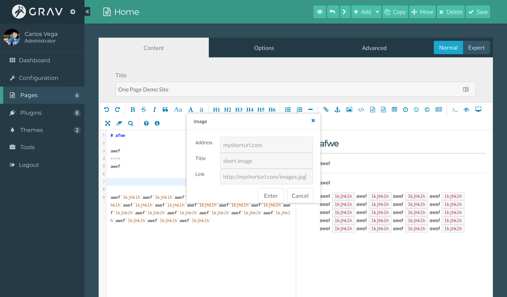
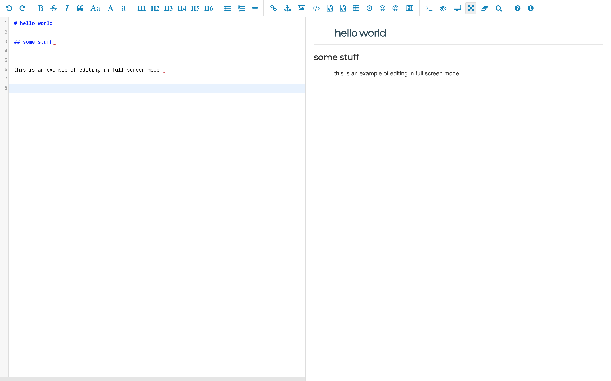

<!-- HTML CODE-->
<link rel="stylesheet" type="text/css" href="https://carlosvegame.github.io/RET-Markdown-Plugin/docs/demo/style.css"/>


**This README.md file should be modified to describe the features, installation, configuration, and general usage of this plugin.**

The **ReT Md Editor** Plugin is for [Grav CMS](http://github.com/getgrav/grav). REader Text-editor (ReT.md), is a markdown editor plugin for grav themes, inspired from TinyMCE Editor grav plugin and pandao/editor.md.

## Inserting Images


## Full Screen


## Installation

Installing the ReT Md Editor plugin can be done in one of two ways. The GPM (Grav Package Manager) installation method enables you to quickly and easily install the plugin with a simple terminal command, while the manual method enables you to do so via a zip file.


### GPM Installation (Preferred)

The simplest way to install this plugin is via the [Grav Package Manager (GPM)](http://learn.getgrav.org/advanced/grav-gpm) through your system's terminal (also called the command line).  From the root of your Grav install type:

    bin/gpm install ret-md-editor

This will install the ReT Md Editor plugin into your `/user/plugins` directory within Grav. Its files can be found under `/your/site/grav/user/plugins/ret-md-editor`.

### Manual Installation

To install this plugin, just download the zip version of this repository and unzip it under `/your/site/grav/user/plugins`. Then, rename the folder to `ret-md-editor`. You can find these files on [GitHub](https://github.com/githubid/grav-plugin-ret-md-editor) or via [GetGrav.org](http://getgrav.org/downloads/plugins#extras).

You should now have all the plugin files under

    /your/site/grav/user/plugins/ret-md-editor

> NOTE: This plugin is a modular component for Grav which requires [Grav](http://github.com/getgrav/grav) and the [Error](https://github.com/getgrav/grav-plugin-error) and [Problems](https://github.com/getgrav/grav-plugin-problems) to operate.

## Configuration

Before configuring this plugin, you should copy the `user/plugins/ret-md-editor/ret-md-editor.yaml` to `user/config/plugins/ret-md-editor.yaml` and only edit that copy.

Here is the default configuration and an explanation of available options:

```yaml
enabled: true
```

## Usage

**Describe how to use the plugin.**

## Credits

**Did you incorporate third-party code? Want to thank somebody?**

## To Do

- [ ] Remake demo
- [ ] add options
- [ ] Clean Code
- [ ] Add theme css, rm defualt css
